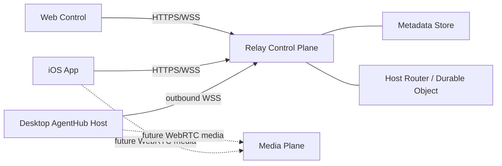

# AgentHub Relay V1 Design

**Date:** 2026-04-03

**Status:** Draft approved for implementation

## Goal

Replace the current `Base URL + token` remote bridge model with a relay-first architecture that supports:

- outbound-only desktop connectivity
- QR pairing instead of manual URL entry
- multiple paired hosts per mobile/web client
- session switching inside a host
- a clean upgrade path for future audio/video calling

## Current Problems

The current implementation assumes a client can talk directly to one bridge endpoint:

- Desktop exposes a local HTTP bridge in `src-tauri/scripts/remote-bridge-worker.mjs`
- Desktop surfaces a token and a public URL in `src/pages/RemoteHostsPage.tsx`
- iOS stores a single `BridgeConfig(baseURL, token)` in `ios-app/Sources/Models/BridgeModels.swift`
- Web control defaults to one `baseUrl` and one `token` in `web-control/app.js`

This breaks down in every multi-device or public-entry scenario:

- a public URL does not know which desktop host it should route to
- a single static token is not enough to model pairing, revocation, or multiple clients
- one client cannot switch across multiple hosts or sessions cleanly
- the transport is text-centric and does not separate call signaling from media transport

## Design Principles

1. Desktop hosts never open public inbound ports
2. Relay is the single public entry point
3. Pairing establishes trust; short-lived credentials establish sessions
4. Transport connections are not bound 1:1 to chat sessions
5. Control plane and media plane are separate from day one
6. Provider-specific deployment details stay behind a small relay contract

## High-Level Architecture



### Control Plane

The control plane handles:

- host registration
- pairing invites and claim
- host list and session list retrieval
- controller lease acquisition
- text turn submission and streaming responses
- future call signaling (`offer`, `answer`, `ice`, `call state`)

### Execution Plane

The desktop host keeps local responsibility for:

- local runtime execution
- access to local thread/session state
- local tools, files, and approvals
- optional local direct bridge compatibility during migration

### Media Plane

The media plane is separate from the relay text/control channel.

Future audio/video features use WebRTC. The recommended first implementation is:

- Cloudflare Worker + Durable Objects for signaling and control
- LiveKit for audio/video rooms

This keeps the relay focused on routing and state instead of carrying production media over a text-oriented WebSocket.

## Deployment Recommendation

### Phase 1 Default

- Cloudflare Worker: public relay HTTP/WebSocket entry
- Durable Objects: per-host routing and in-memory connection state
- D1: persistent metadata for hosts, clients, invites, and session snapshots

### Future Media Deployment

- LiveKit Cloud or self-hosted LiveKit for media rooms
- Relay stores room metadata and call state only

### Self-Hosting

The control plane protocol must remain provider-agnostic.

Cloudflare is the default implementation, not the only supported deployment target. A future Node/Fly/Railway relay should be able to implement the same contract.

## Core Domain Model

### Host

A host is one desktop AgentHub instance.

Fields:

- `hostId`
- `displayName`
- `platform`
- `runtimeVersion`
- `status`
- `lastSeenAt`
- `capabilities`

### Session

A session is one local thread or conversation on a host.

Fields:

- `sessionId`
- `hostId`
- `title`
- `summary`
- `updatedAt`
- `primaryAgentId`
- `state`

### Client

A client is one mobile or web app instance.

Fields:

- `clientId`
- `kind` (`ios`, `web`)
- `label`
- `pairedHosts[]`

### PairingInvite

A pairing invite is a one-time claim token generated by a host.

Fields:

- `inviteId`
- `hostId`
- `code`
- `expiresAt`
- `claimedAt`

### ControllerLease

V1 uses a single active controller per host.

Fields:

- `hostId`
- `clientId`
- `leaseId`
- `grantedAt`
- `expiresAt`

### Call

This exists in the model now even though media lands later.

Fields:

- `callId`
- `hostId`
- `sessionId`
- `roomId`
- `mode` (`audio`, `video`, `camera-share`)
- `state`

## Transport Model

### Rule 1: One host, one primary connection

Each desktop host maintains one active outbound relay connection.

If the same host reconnects, the relay replaces the old connection with the new generation.

### Rule 2: Clients can pair with many hosts

One iPhone or web client can pair with multiple hosts.

### Rule 3: Sessions are selected over an existing host connection

The client navigation model is:

`Hosts -> Sessions -> Chat/Control`

The host transport stays alive while the selected session changes.

### Rule 4: V1 allows one controller, optional future watchers

Only one client has write/control authority for a host at a time.

Future watchers may subscribe read-only without holding the controller lease.

## Security Model

### Credentials

1. `pairing code`
   one-time, short-lived, delivered via QR
2. `host credential`
   long-lived credential for desktop re-registration
3. `client credential`
   long-lived paired-device credential, revocable
4. `access token`
   short-lived session credential used for API/WS access

### Guarantees for V1

- TLS for all public traffic
- no public inbound desktop ports
- revocable paired devices
- expiring invites
- expiring controller leases
- message dedupe and connection generation tracking

### Deferred to V2

- end-to-end encrypted payloads in the Happy style
- team/user account model
- organization policy and shared device directories

## Relay API Surface

### Public HTTP

- `POST /api/pairing/invites/claim`
- `GET /api/hosts`
- `GET /api/hosts/:hostId/sessions`
- `POST /api/hosts/:hostId/lease`
- `DELETE /api/hosts/:hostId/lease`
- `GET /api/hosts/:hostId/sessions/:sessionId`
- `POST /api/hosts/:hostId/turns`

### Host WebSocket

- `GET /api/hosts/connect`

Desktop authenticates with a host access token and then exchanges JSON envelopes:

- `host.register`
- `host.presence`
- `host.sessions.snapshot`
- `host.turn.result`
- `host.turn.chunk`
- `host.error`
- `signal.call.*` (future)

### Client WebSocket

Optional in V1 for streaming turn responses. V1 can start with HTTP + server-sent event style relay semantics if needed, but the envelope schema should already support streaming chunks.

## Envelope Contract

Every relay-routed message shares the same shape:

```json
{
  "messageId": "msg_123",
  "hostId": "host_123",
  "sessionId": "thread_123",
  "type": "turn.submit",
  "seq": 12,
  "sentAt": "2026-04-03T12:00:00.000Z",
  "payload": {}
}
```

Required fields:

- `messageId` for idempotency
- `seq` for ordering within a connection generation
- `hostId` to route into a host room
- `sessionId` for session-scoped actions
- `type` to dispatch behavior

## Desktop Responsibilities

The desktop app gains a relay agent alongside the existing local bridge:

- reads local collaboration/session state
- opens the host WebSocket
- syncs host metadata and session snapshots
- receives `turn.submit`
- executes against the local runtime/bridge layer
- returns streamed chunks and final turn results

The existing local bridge remains useful as:

- an internal execution adapter
- a local-only debug path
- a migration fallback

## Mobile and Web UX

### Desktop

- Remote Hosts page shows relay status
- user can start/stop relay registration
- user can generate a pairing QR
- user can revoke paired devices later

### iOS

Replace manual `Base URL + token` onboarding with:

- scan pairing QR
- view paired hosts
- select host
- view host sessions
- switch session
- chat with active session

### Web

Web control uses the same relay contract:

- pair or sign in later
- choose host
- choose session
- chat/control

## Audio and Video Upgrade Path

The relay contract must reserve signaling event types now:

- `call.create`
- `call.offer`
- `call.answer`
- `call.ice`
- `call.end`

This allows future support for:

- audio call with the local agent
- video call with the local agent
- live camera share from phone to host
- optional screen share from desktop

The call object associates media state with a host and optionally a session, but media transport stays in the media plane.

## Implementation Phases

### Phase 1

- relay worker scaffold
- host room durable object
- host registration and presence
- pairing invite generation and claim
- paired host listing
- session snapshot sync
- session switching
- text turn submit and streamed response envelope support

### Phase 2

- web control migration to relay
- watcher mode and control takeover
- reliable reconnect and replay handling
- push/approval primitives

### Phase 3

- media signaling
- LiveKit integration
- audio calling
- video calling and camera share
- optional end-to-end encrypted payload upgrade

## Migration Strategy

The migration must be incremental.

1. Keep the current local bridge intact
2. Add the relay worker and desktop relay agent
3. Switch iOS from manual URL config to pairing
4. Switch web control from shared token URL to relay host/session navigation
5. Keep a local-only advanced mode for debugging

## Acceptance Criteria for Phase 1

- A desktop host can register with relay over outbound-only transport
- A phone can pair by scanning a QR generated on desktop
- One phone can see multiple paired hosts
- One paired host can expose multiple sessions
- The phone can switch sessions without re-pairing
- The phone can send a turn to the selected session
- The desktop can execute the turn and stream results back

